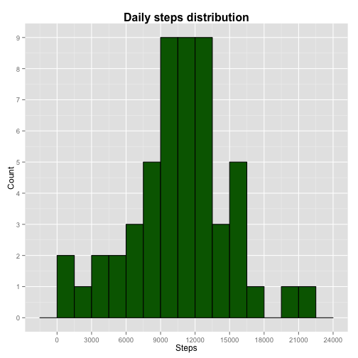
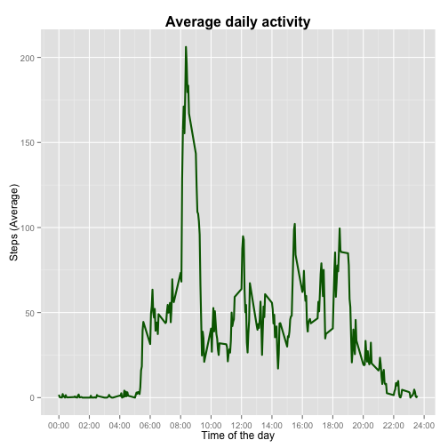
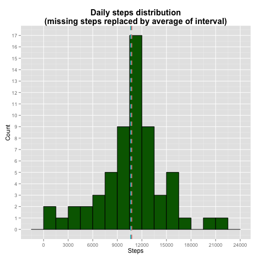
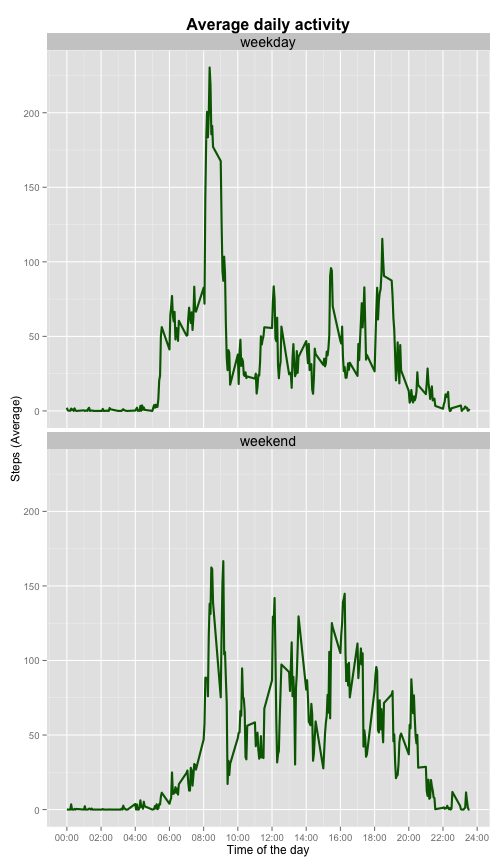

# Reproducible Research: Peer Assessment 1


## Loading and preprocessing the data
Besides reading the csv file, my only preprocessing was to convert the date column to a Date class because
later I  applied some date functions on this column.  

```r
setwd("~/Documents/DataScienceSpecialization/ReproducibleResearch/RepData_PeerAssessment1")
activities = read.csv("data/activity.csv")
activities$date = as.Date(activities$date)
```

## What is mean total number of steps taken per day?
Below is the histogram that shows the distribution of the amount of steps per day.
Together with this histogram I plotted two vertical lines to show the mean and the median,
but mean and median are so close that their lines overlapped.  

```r
library(ggplot2)
dailyActivities = aggregate(steps ~ date, activities, sum)

dfstats = data.frame(measure=factor(c("mean", "median")), 
                     val=c(round(mean(dailyActivities$steps, na.rm=T), 2),
                           round(median(dailyActivities$steps, na.rm=T), 2)))

m = ggplot(dailyActivities, aes(steps))
m + geom_histogram(binwidth=1500, fill="darkgreen", color="black") + 
    ggtitle("Daily steps distribution") + 
    theme(plot.title = element_text(lineheight=0.9, face="bold", size=16)) + 
    scale_y_continuous(name="Count", breaks=0:10*1) +
    scale_x_continuous(name="Steps", breaks=0:24000*3000) + 
    geom_vline(data=dfstats, aes(xintercept=val, color=measure), linetype="dashed", size=1) 
```

 

This table shows how close mean and median are.

```r
library(xtable)
xt <- xtable(dfstats)
print(xt, type="html")
```

<!-- html table generated in R 3.0.3 by xtable 1.7-3 package -->
<!-- Sun Jun 15 00:45:01 2014 -->
<TABLE border=1>
<TR> <TH>  </TH> <TH> measure </TH> <TH> val </TH>  </TR>
  <TR> <TD align="right"> 1 </TD> <TD> mean </TD> <TD align="right"> 10766.19 </TD> </TR>
  <TR> <TD align="right"> 2 </TD> <TD> median </TD> <TD align="right"> 10765.00 </TD> </TR>
   </TABLE>

## What is the average daily activity pattern?
By plotting the average daily activity one can observe that the subject starts to walk after 5AM and stops before 12AM.

```r
m = ggplot(activities, aes(interval, steps))
m + stat_summary(fun.y=mean, colour="darkgreen", geom="line", size=1) +
    scale_x_continuous(name="Time of the day", breaks=seq(0, 2400, 200), 
                       labels=paste(sprintf("%02d",seq(from=0, to=24, by=2)), "00", sep=":")) + 
    ylab("Steps (Average)") + 
    ggtitle("Average daily activity") + 
    theme(plot.title = element_text(lineheight=0.9, face="bold", size=16)) 
```

 


```r
library(stringr)

intervalActivities = aggregate(steps ~ interval, activities, mean)
highActivity = head(intervalActivities[order(-intervalActivities$steps),], 1)$interval
hour=highActivity %/% 100
minute=highActivity %% 100

maxNumOfStepsInterval = paste(str_pad(hour, 2, pad="0"), str_pad(minute, 2, pad="0"), sep=":")
```
There is a peak of steps at **``08:35``**

## Imputing missing values

```r
missingValues = is.na(activities$steps)
amountMissingValues = sum(missingValues)
```
The original dataset has **``2304``** missing values for steps. I filled all missing values
using the mean for the same 5-minute interval. Below is a new histogram that shows how daily steps distribution
changed after replacing missing values with the mean for the same interval. Now the mean (in orange) and median (light blue) are visible.  


```r
activitiesStepNA = subset(activities, subset=missingValues)
activitiesNAStepAverage = merge(activitiesStepNA, intervalActivities, by.x="interval", by.y="interval")
activitiesStepAverage = subset(activitiesNAStepAverage, select=c(interval, steps.y, date))
activitiesMissingDataFilled = merge(activities, activitiesStepAverage, by=c("date", "interval"), all.x=T)

activitiesMissingDataFilled[missingValues,]$steps = floor(activitiesMissingDataFilled[missingValues,]$steps.y)

dailyActivities = aggregate(steps ~ date, activitiesMissingDataFilled, sum)

dfstats = data.frame(measure=factor(c("mean", "median")), 
                     val=c(round(mean(dailyActivities$steps, na.rm=T), 2),
                           round(median(dailyActivities$steps, na.rm=T), 2)))

m = ggplot(dailyActivities, aes(steps))
m + geom_histogram(binwidth=1500, fill="darkgreen", color="black") + 
    ggtitle("Daily steps distribution\n(missing steps replaced by average of interval)") + 
    theme(plot.title = element_text(lineheight=0.9, face="bold", size=16)) + 
    scale_y_continuous(name="Count", breaks=0:18*1) +
    scale_x_continuous(name="Steps", breaks=0:24000*3000) + 
    geom_vline(data=dfstats, aes(xintercept=val, color=measure), linetype="dashed", size=1) 
```

 

This table shows the new values for mean and median.

```r
library(xtable)
xt <- xtable(dfstats)
print(xt, type="html")
```

<!-- html table generated in R 3.0.3 by xtable 1.7-3 package -->
<!-- Sun Jun 15 00:45:03 2014 -->
<TABLE border=1>
<TR> <TH>  </TH> <TH> measure </TH> <TH> val </TH>  </TR>
  <TR> <TD align="right"> 1 </TD> <TD> mean </TD> <TD align="right"> 10749.77 </TD> </TR>
  <TR> <TD align="right"> 2 </TD> <TD> median </TD> <TD align="right"> 10641.00 </TD> </TR>
   </TABLE>

## Are there differences in activity patterns between weekdays and weekends?
Yes. During weekends the subject is less active early in the morning, and more active during afternoon.

```r
Sys.setlocale("LC_TIME", "en_US.UTF-8")
activitiesMissingDataFilled$weekday = 
  factor(
      ifelse(weekdays(activitiesMissingDataFilled$date) %in% c("Saturday", "Sunday"), 
             "weekend", "weekday"))

m = ggplot(activitiesMissingDataFilled, aes(interval, steps))
m + stat_summary(fun.y=mean, colour="darkgreen", geom="line", size=1) +
  scale_x_continuous(name="Time of the day", breaks=seq(0, 2400, 200), 
                     labels=paste(sprintf("%02d",seq(from=0, to=24, by=2)), "00", sep=":")) + 
  ylab("Steps (Average)") + 
  ggtitle("Average daily activity") + 
  theme(plot.title = element_text(lineheight=0.9, face="bold", size=16)) +
  facet_wrap(~ weekday, nrow=2, ncol=1) + 
  theme(strip.text.x = element_text(size = 14))
```

 
